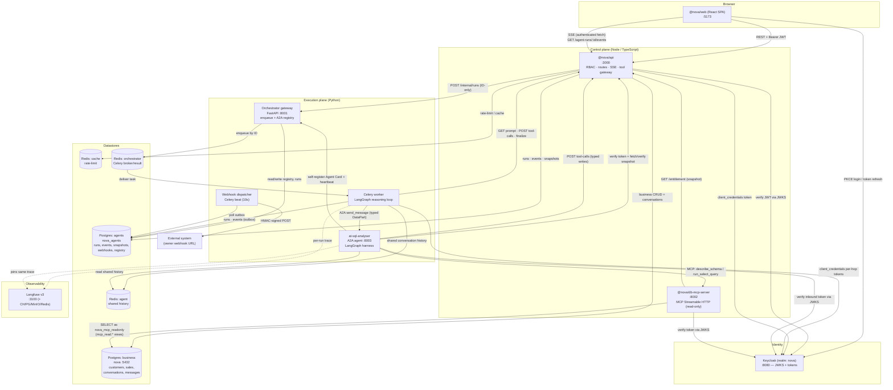

# Nova Platform — Solution Design

> A detailed architectural reference for the Nova agentic platform: what every
> component is, how the components fit together, and exactly how a user question
> travels from the browser, through the orchestrator, to an A2A agent and its MCP
> tools, and how progress is pushed back to the browser and to external systems.

---

## Table of contents

1. [Section 1 — Components](#section-1--components)
2. [Section 2 — System Design (Diagram 1)](#section-2--system-design-diagram-1)
3. [Section 3 — Agentic Flow (Diagram 2)](#section-3--agentic-flow-diagram-2)
4. [Appendix — Identities, audiences & ports](#appendix--identities-audiences--ports)

---

## Core architectural idea

Nova is split into **two planes** that never blur into each other:

- **Control plane (Node.js / TypeScript)** — the only thing a browser ever talks
  to. It owns identity, RBAC, business data, conversations, and the *durable
  record* of every agent run. It decides **what a user is allowed to do** and
  hands the agent layer an immutable **entitlement snapshot**.
- **Execution plane (Python)** — runs the actual agentic work asynchronously. It
  is a **pure delegator/worker**: it never sees the user's token, never connects
  to the business database directly, and re-checks every authorization decision
  against the snapshot before acting.

Everything below is an elaboration of that split. The guiding rules are **default
deny, least privilege, centralized auth, and ID-only messaging** (no prompts,
tokens, or PII are ever placed on a queue or in an A2A message).

---

# Section 1 — Components

This section lists every component in the solution and describes precisely what it
does and how it works in practice. Components are grouped by plane.

### 1.1 Frontend (presentation layer)

| Component | Tech | What it does |
|-----------|------|--------------|
| **`@nova/web`** (React SPA) | React 19, Vite 8, TypeScript, TanStack Query, `react-router-dom` v7, `keycloak-js` | The single-page operations console and the **agent chat** UI. Served as a static build behind nginx on host port **5173**. |

**How it works in practice**

- **Auth:** Uses Keycloak with the **PKCE (S256)** authorization-code flow
  (`onLoad: 'check-sso'`). Tokens live in the Keycloak adapter's memory (never in
  `localStorage`). The frontend is **never an authorization authority** —
  effective permissions come from `GET /api/v1/auth/me`, and route guards
  (`RequireAuth`, `RequirePermission`) are **UX only**; the backend enforces.
- **HTTP:** Every REST call goes through one typed `httpClient` that attaches
  `Authorization: Bearer <token>` and normalizes errors to RFC 7807
  `problem+json`. Base URL defaults to `http://localhost:3000/api/v1`.
- **Asking a question:** The chat composer calls `POST /api/v1/a2a/chat` with an
  `Idempotency-Key` header. The call returns **202** with a `runId`. The user and
  assistant messages are persisted **server-side**; the SPA never POSTs messages
  to a messages endpoint directly — it triggers a run, streams progress, then
  refetches the conversation.
- **Live updates:** Subscribes to **Server-Sent Events (SSE)** at
  `GET /api/v1/agent-runs/:runId/events` over an *authenticated `fetch` stream*
  (native `EventSource` can't send an `Authorization` header). It resumes with
  `Last-Event-ID` and stops on a terminal `run.*` event. `LiveRunTrace` renders the
  step-by-step activity; `?detail=full` backfills technical/owner-only events.

### 1.2 Identity & infrastructure (shared)

| Component | Tech | What it does |
|-----------|------|--------------|
| **Keycloak** | Keycloak (realm `nova`) | Central IdP. Issues user tokens (browser login) **and** service tokens (`client_credentials`) for every service-to-service hop. Hosts the JWKS that every service uses to validate JWTs. Port **8080**. |
| **PostgreSQL — business** (`nova`) | Postgres 16 | The business database: customers, products, sales, issues, actions, SOPs, users, **conversations & messages**. Port **5432**. |
| **PostgreSQL — agents** (`nova_agents`) | Postgres 16 | The **isolated orchestration-state DB**: `agent_runs`, `agent_run_entitlements`, `agent_run_events`, `webhook_auth_configs`, `webhook_deliveries`, `a2a_agent_registrations`. The execution plane never touches the business DB. |
| **Redis — cache** | Redis 7 (LRU) | Shared cache + cross-replica rate-limit store for the API. |
| **Redis — orchestrator** | Redis 7 (`noeviction`) | Celery broker + result backend for the execution plane. |
| **Redis — agent** | Redis 7 (`noeviction`) | Optional shared **conversation history** + per-agent working state (owner-scoped, TTL'd). Worker is the single writer; agents read. |

### 1.3 Control plane (Node.js / TypeScript)

| Component | Tech | What it does |
|-----------|------|--------------|
| **`@nova/api`** | Node ≥22, Express 4, TypeORM 0.3, `jose`, `zod`, `helmet` | The sole user-facing edge. Port **3000**. |
| **`@nova/db-mcp-server`** | Node ≥22, `@modelcontextprotocol/sdk`, Express, `pg`, `pgsql-parser` | A spec-compliant **MCP resource server** exposing the business data as secure, read-only tools. Port **8002** (internal only). |
| **`@nova/shared`** | TypeScript | RBAC registry, capability catalog, `ServiceTokenClient`, errors, logging, snapshot hashing. |
| **`@nova/database`** | TypeORM | Entities, migrations, and the two datasources (business + agents). Also provisions the `mcp_read` curated views and the least-privileged `nova_mcp_readonly` DB role. |

**`@nova/api` — how it works in practice**

- **Authentication:** `jose` verifies Keycloak JWTs against remote JWKS
  (`RS256`/`ES256` only, checked `iss`/`aud`/`exp`). Roles come from the token;
  **permissions are derived from roles** (never trusted from token claims).
- **Authorization:** A **centralized typed route registry** (`defineRoutePolicy`)
  declares each route as `public`, `authenticated`, or `permission`-gated.
  `authorize()` is **default deny**. There are no ad-hoc, route-level permission
  checks.
- **Business routes:** CRUD for customers, products, sales, issues, actions, SOPs,
  admin, conversations, `me`.
- **Agent-run control plane:** `POST /api/v1/a2a/chat` (start a run, 202),
  `GET /agent-runs/:id` (status), `GET /agent-runs/:id/events` (**SSE**),
  `GET /agent-runs/:id/trace` (full trace after completion),
  `POST /agent-runs/:id/cancel`.
- **Internal tool gateway** (`/internal/agent-runs/*`, **service-token only**, no
  user context): `GET /:id/prompt` (worker fetches the user message),
  `GET /:id/entitlement` (snapshot read-back for agents/MCP),
  `POST /:id/tool-calls` (the **authoritative write path** — typed capability
  execution with entitlement re-enforcement), `POST /:id/finalize` (persist the
  assistant message).
- **Run creation:** persists the user message to the business DB, builds an
  **immutable `EntitlementSnapshot`** from the `AuthContext`, writes the run +
  snapshot to the agents DB (`status: queued`, `promptRef = nova-msg://…`), then
  does a best-effort **ID-only** enqueue to the orchestrator.

**`@nova/db-mcp-server` — how it works in practice**

- **Transport:** **MCP Streamable HTTP** (`StreamableHTTPServerTransport`) over
  Express at `POST /mcp` — *not* stdio. Stateful sessions keyed by
  `mcp-session-id`; every HTTP request is re-authenticated at the boundary.
- **Tools exposed** (registered only when the run's snapshot entitles them):
  - `describe_schema` / `list_views` (capability `data.schema.describe`) — curated
    `mcp_read.*` view metadata (columns, types, PII flags).
  - `run_select_query` (capability `data.query.select`) — runs a validated,
    read-only `SELECT`.
- **Security pipeline for a query:** authorize capability → `validateSelect`
  (single SELECT, allowlisted relations, no DML/DDL/dangerous functions) →
  `findForbiddenView` (every joined view must be entitled) → clamp to a `LIMIT` →
  run inside a `BEGIN READ ONLY` transaction with `statement_timeout` and an owner
  GUC → cap result bytes.
- **DB identity:** connects only as `nova_mcp_readonly` (SELECT-only on
  `mcp_read`, `default_transaction_read_only = on`). It never uses business
  credentials and **never performs writes**.

### 1.4 Execution plane (Python)

| Component | Tech | What it does |
|-----------|------|--------------|
| **Orchestrator gateway** (`nova-orchestrator`) | FastAPI, `a2a-sdk` | FastAPI ingress on **8001**. Validates the inbound `nova-api` service token and **enqueues the Celery run by ID only**. Also hosts `POST /internal/agents/register` for **A2A self-registration**. Does *not* expose user chat and is *not* an A2A server. |
| **Celery worker** (`nova-celery-worker`) | Celery, LangGraph, LangChain, `a2a-sdk` | The brain. Runs the bounded **LangGraph** reason→dispatch→critique→compose loop, selects a delegation skill via the LLM, resolves it to an agent, and calls that agent over **A2A**. Mints audience-restricted per-hop tokens. Never touches the business DB. |
| **Webhook dispatcher** (`nova-celery-webhook`) | Celery beat | Polls the webhook transactional outbox every **10 s** on a separate `webhooks` queue, signs each delivery with **HMAC**, and retries with backoff. Decoupled so a slow receiver never blocks orchestration. |
| **`at-sql-analyser`** (`nova-agent-sql-analyst`) | `a2a-sdk` (Starlette), LangGraph, `mcp` client | The default **A2A data agent** on **8003**. Answers data questions via DB-MCP reads and performs typed writes via the Node tool gateway. Runs its own bounded LangGraph harness. |
| **Langfuse v3** (`langfuse-web` + worker + ClickHouse/MinIO/PG/Redis) | Langfuse 3 (OTel-native) | LLM observability. One **per-run trace** (deterministic from `runId`); the agent **joins the same trace** over A2A so every node, LLM call, and tool hop nests under one context. Fail-soft. Web UI on **3100**. |

**Orchestrator worker — how it works in practice**

- **Pure delegator:** the LLM never executes business tools and never picks a
  concrete agent. It picks an **umbrella delegation skill** (`data.analyse.read`
  or `data.act.write`) from a menu pre-filtered by the entitlement snapshot.
- **Two-layer routing:**
  - **Layer A (LLM):** chooses one umbrella skill per turn via OpenAI tool calling.
  - **Layer B (deterministic):** the registry maps the chosen skill → a registered
    agent, then `evaluate_capability()` (default deny) gates the hop.
- **Discovery:** agents self-register their **Agent Card** into
  `a2a_agent_registrations` and heartbeat; the worker loads only registrations seen
  within the TTL (default 120 s), with a static `at-sql-analyser` seed as fallback.
- **A2A call:** mints an audience-restricted token, resolves the agent card,
  builds a `Message` with a typed `DataPart` (`runId`, `skillId`, `goal`,
  `approvalGranted`, `conversationId`, Langfuse trace IDs), and streams sub-events
  back.
- **Durability:** there is **no LangGraph checkpoint store** — graph state is
  in-memory for a single run. Durability lives in the agents DB
  (`agent_runs` + append-only `agent_run_events`).

**`at-sql-analyser` — how it works in practice**

- **A2A surface:** advertises an Agent Card (`capabilities.streaming = true`,
  `push_notifications = false`) with skills `data.analyse.read` and
  `data.act.write`. Inbound requests pass `BearerAuthMiddleware` (validates `aud`,
  `iss`, `exp`, and pins `azp` to `nova-celery-worker`).
- **Trust pipeline before any work:** verify token → parse typed task → **fetch
  and re-verify the entitlement snapshot by `runId`** from the API → `authorize()`
  the skill → run graph. The snapshot is *never* sent in the A2A message.
- **Read path:** a bounded LangGraph loop (`load_schema → plan_read → validate →
  execute → critique → compose`). SQL runs through the **DB-MCP** Streamable HTTP
  client; structured reads (e.g. `customers.search`) go through the Node gateway.
- **Write path:** writes are **never raw SQL**. The agent calls cataloged
  capabilities via `POST /internal/agent-runs/:runId/tool-calls` on the API, which
  re-enforces entitlements and is approval-gated for the high-risk umbrella.
- **Streaming:** publishes `TaskState.working` updates carrying a `novaEvent`
  metadata payload for each sub-event, plus a terminal artifact reconciling any
  missed events.

### 1.5 Cross-cutting concepts

- **Entitlement snapshot:** an immutable, hashed capture of the user's roles/
  permissions at run-creation time. Bounds what the run may do for up to
  `AGENT_RUN_TTL_SECONDS` (default 7200 s), independent of the user's short-lived
  token. Every downstream actor re-verifies the hash and **fails closed** on
  mismatch.
- **Capabilities & RBAC:** a typed catalog (`nova_authz`) maps roles → permissions
  → capabilities. The same model is enforced in Node, in the MCP server, and in
  the Python agents (generated copies kept in sync).
- **Transactional outbox:** `agent_run_events` and `webhook_deliveries` are written
  in the same DB transaction as state changes, decoupling progress reporting and
  webhook delivery from the hot path.

---

# Section 2 — System Design (Diagram 1)

This diagram shows **every component and how each interacts with the others**:
trust boundaries, transports (HTTP, SSE, A2A, MCP, Celery, SQL), and the
control-plane / execution-plane split.



### 2.1 How to read the diagram

- **Solid arrows** are request/data flows on the hot path. **Dotted arrows** are
  fail-soft observability (a Langfuse outage never fails a run).
- The **only** public ingress is `@nova/web → @nova/api`. Everything in the
  execution plane and the MCP server is reachable **only on the internal network**.
- **Keycloak is the hub of trust:** every box that receives a request validates a
  JWT against Keycloak's JWKS, and every box that makes an outbound call first
  mints a `client_credentials` token scoped to the **specific audience** of the
  callee.

### 2.2 Trust boundaries and why they exist

1. **Browser → API.** User JWT, RBAC-gated. The browser is never trusted for
   authorization.
2. **API → Orchestrator.** Service token (`aud: nova-orchestrator`). The payload is
   **ID-only** — no prompt, no user token, no PII ever reaches the queue.
3. **Worker → Agent (A2A).** Service token (`aud: nova-agent-sql-analyst`, pinned
   `azp: nova-celery-worker`). The typed `DataPart` carries IDs and the goal text —
   never the snapshot or a user token.
4. **Agent → MCP / API.** Separate audiences per purpose
   (`nova-mcp-data` for reads, `nova-mcp-sales` for the write gateway). The agent
   re-fetches and re-verifies the entitlement snapshot by `runId`.
5. **MCP → business DB.** Least-privileged `nova_mcp_readonly` role, read-only
   transactions, curated `mcp_read` views only.

### 2.3 The two databases

The execution plane is **physically isolated** from business data. It reads/writes
its own `nova_agents` database (run lifecycle, append-only events, snapshots,
webhook config, agent registry). The only way it can ever touch business data is
**through** the API tool gateway (writes/structured reads) or the MCP server
(read-only SQL) — both of which re-enforce the entitlement snapshot. Cross-DB
references are logical (`nova-msg://{conversationId}/{messageId}`), never foreign
keys.

### 2.4 A note on real-time transports (SSE vs WebSockets vs webhooks)

The platform deliberately uses **three different push mechanisms**, each where it
fits best — and notably it does **not** use WebSockets:

| Mechanism | Direction | Used for | Why |
|-----------|-----------|----------|-----|
| **SSE** | API → Browser | Live run progress to the user | One-way server→client stream; works over an authenticated `fetch` with `Last-Event-ID` resume. A bidirectional WebSocket is unnecessary because the client only sends the *initial* request (over REST) and then only *receives*. |
| **Webhooks** | Orchestrator → external systems | Server-to-server push to owner-configured URLs | Durable, HMAC-signed, retried via a transactional outbox + Celery beat. Appropriate for integrations that aren't holding an open connection. |
| **A2A streaming** | Agent → Worker | Mid-run sub-events within one request | Carried as `TaskState.working` updates on the same A2A HTTP task stream. |

> **Practical clarification:** the chat experience feels "real-time" via **SSE**,
> not WebSockets. Internally, the worker persists every agent sub-event to the
> `agent_run_events` outbox; the API streams those `user`-visibility rows to the
> browser over SSE. External, server-to-server delivery is handled by the
> **webhook** dispatcher. This is the modern, secure equivalent of "push
> notifications to the webhook and the websocket" requested — implemented as
> outbox→webhook (server-to-server) and outbox→SSE (browser).

---

# Section 3 — Agentic Flow (Diagram 2)

This is the heart of the system: what happens from the moment a user asks a
question, through orchestration, agent selection, MCP tool use, and the push of
progress back to the browser (SSE) and external systems (webhooks).

```mermaid
sequenceDiagram
    autonumber
    actor U as User (Browser)
    participant API as @nova/api (:3000)
    participant BIZ as Postgres business
    participant AG as Postgres agents
    participant GW as Orchestrator gateway (:8001)
    participant Q as Redis (Celery)
    participant WK as Celery worker (LangGraph)
    participant LLM as LLM (OpenAI-compatible)
    participant SQL as at-sql-analyser (A2A :8003)
    participant MCP as db-mcp-server (:8002)
    participant WH as Webhook dispatcher
    participant EXT as External webhook URL

    Note over U,API: 1) Ask a question
    U->>API: POST /api/v1/a2a/chat {message} + Bearer + Idempotency-Key
    API->>API: verify JWT (JWKS), derive permissions, authorize()
    API->>BIZ: persist USER message (conversation)
    API->>AG: create run (queued) + immutable entitlement snapshot
    API->>GW: POST /internal/runs {runId, snapshotId, hash} (ID-only)
    API-->>U: 202 {runId, conversationId}

    Note over U,API: 2) Browser subscribes to progress (SSE)
    U->>API: GET /agent-runs/:runId/events (Accept: text/event-stream)
    API-->>U: stream run.accepted, run.started, ...

    Note over GW,WK: 3) Async pickup
    GW->>Q: enqueue task by ID
    Q->>WK: deliver {runId, snapshotId, hash}
    WK->>AG: load run + entitlement snapshot
    WK->>WK: verify snapshot hash (fail closed)
    WK->>API: GET /internal/agent-runs/:runId/prompt
    API->>BIZ: read user message
    API-->>WK: {message}
    WK->>AG: emit run.accepted / run.started (outbox)

    Note over WK,LLM: 4) Layer A — reason (pick a delegation skill)
    WK->>AG: load live agent registry (Agent Cards)
    WK->>LLM: reason(prompt, menu=[data.analyse.read, data.act.write])
    LLM-->>WK: tool_call -> data.analyse.read

    Note over WK,SQL: 5) Layer B — resolve skill -> agent, gate, dispatch
    WK->>WK: registry.agent_for_skill() + evaluate_capability() (default deny)
    WK->>API: mint token (aud: nova-agent-sql-analyst)
    WK->>SQL: A2A send_message (DataPart: runId, skillId, goal, langfuseTraceId)

    Note over SQL,API: 6) Agent re-establishes trust
    SQL->>SQL: verify Bearer (aud + azp pin)
    SQL->>API: GET /internal/agent-runs/:runId/entitlement
    API-->>SQL: verified snapshot
    SQL->>SQL: authorize(skill) against snapshot

    Note over SQL,MCP: 7) Agent uses MCP tools (read path)
    SQL->>MCP: MCP initialize (Bearer aud: nova-mcp-data, X-Nova-Run-Id)
    MCP->>API: GET /entitlement (verify by runId)
    SQL->>MCP: tool describe_schema
    MCP-->>SQL: curated mcp_read views
    SQL->>LLM: plan_read -> SELECT
    SQL->>MCP: tool run_select_query {sql, params}
    MCP->>MCP: validate SELECT + view allowlist + LIMIT
    MCP->>BIZ: READ ONLY query as nova_mcp_readonly
    MCP-->>SQL: rows
    SQL-->>WK: TaskState.working (novaEvent: agent.query.completed)
    WK->>AG: persist forwarded sub-event (outbox)
    API-->>U: SSE agent.query.* (live)

    Note over SQL,WK: 8) Agent composes + returns
    SQL->>LLM: critique -> satisfied; compose final answer
    SQL-->>WK: terminal Task (completed, answer, events[])

    Note over WK,API: 9) Critique / compose / finalize
    WK->>LLM: critique -> satisfied -> compose
    WK->>API: POST /internal/agent-runs/:runId/finalize {text, links}
    API->>BIZ: persist ASSISTANT message
    WK->>AG: emit run.completed (outbox)

    Note over AG,EXT: 10) Push back out
    API-->>U: SSE run.completed (stream ends)
    U->>API: refetch conversation -> assistant message shown
    WH->>AG: poll webhook outbox (every 10s)
    WH->>EXT: HMAC-signed POST {events[]}
```

### 3.1 Step-by-step walkthrough

**1 — Ask a question.** The user types in the chat composer. The SPA sends
`POST /api/v1/a2a/chat` with the message, an `Idempotency-Key`, and the Keycloak
bearer token. The API validates the token against Keycloak's JWKS, derives
permissions from roles, and runs the `create-agent-run` route policy
(**default deny**).

**2 — Persist + snapshot + enqueue.** The API writes the **user message** to the
business DB, creates an `AgentRun` (`status: queued`) plus an **immutable
entitlement snapshot** in the agents DB, and then makes an **ID-only** call to the
orchestrator gateway (`POST /internal/runs` with `runId`, `entitlementSnapshotId`,
`entitlementSnapshotHash` — *no prompt, no token, no PII*). The user gets a fast
**202** with the `runId`.

**3 — Subscribe to progress (SSE).** The SPA opens the SSE stream at
`GET /agent-runs/:runId/events` (authenticated `fetch`). From here on, every
`user`-visibility event the orchestrator writes to the outbox is streamed to the
browser, resumable via `Last-Event-ID`.

**4 — Async pickup.** The gateway enqueues the task by ID on the orchestrator
Redis; a Celery **worker** picks it up. The worker loads the run and snapshot from
the agents DB, **re-verifies the snapshot hash** (fail closed on mismatch), then
calls back to the API's internal tool gateway to **fetch the actual prompt** by
`runId` (the prompt never traveled on the queue). It emits `run.accepted` /
`run.started` to the outbox.

**5 — Layer A routing (LLM picks a skill).** The worker loads the **live agent
registry** (Agent Cards self-registered + heartbeated within the TTL) and builds a
**menu** of umbrella delegation skills filtered by the snapshot's allowlist —
typically just `data.analyse.read` and `data.act.write`. It calls the LLM, which
**must call exactly one tool**. Crucially, the LLM picks an *abstract skill*, not a
concrete agent, and never populates record IDs.

**6 — Layer B routing (deterministic agent selection + gate).** The worker maps the
chosen skill → a registered agent via `registry.agent_for_skill()`, then runs
`evaluate_capability()` (**default deny**, plus approval checks for the high-risk
write umbrella). Only then does it mint a token scoped to
`aud: nova-agent-sql-analyst` and call the agent over **A2A `send_message`**,
passing a typed `DataPart` (`runId`, `skillId`, `goal`, `approvalGranted`,
`conversationId`, and the Langfuse trace IDs so the agent joins the same trace).

**7 — Agent re-establishes trust.** The agent's `BearerAuthMiddleware` validates
the token (`aud` + pinned `azp: nova-celery-worker`). Because the snapshot is
**never** sent in the message, the agent calls
`GET /internal/agent-runs/:runId/entitlement` to fetch and re-verify it, then
`authorize()`s the requested skill against it.

**8 — Agent uses MCP tools (the read path).** The agent runs its own bounded
LangGraph harness:
- It opens an **MCP Streamable HTTP** session to `db-mcp-server` with a
  `nova-mcp-data`-audience token and `X-Nova-Run-Id`. The MCP server independently
  fetches and verifies the snapshot by `runId`.
- `describe_schema` returns the curated `mcp_read.*` views (with PII flags).
- The LLM `plan_read` step proposes a single parameterized `SELECT`.
- `run_select_query` is validated (single SELECT, allowlisted views, forced
  `LIMIT`), executed in a `READ ONLY` transaction as `nova_mcp_readonly`, and rows
  are returned in-process to the agent only.
- For structured reads or **writes**, the agent instead calls the **Node tool
  gateway** (`POST /internal/agent-runs/:runId/tool-calls`) — writes are *never*
  raw SQL and are entitlement-/approval-gated there.

**9 — Streaming sub-events (the "push" while working).** As the agent works it
emits `TaskState.working` updates carrying a `novaEvent` payload (e.g.
`agent.schema.loaded`, `agent.query.started/completed`). The worker's stream sink
**persists each sub-event to the `agent_run_events` outbox** in its own short
transaction. The API surfaces `user`-visibility rows to the browser over **SSE** in
near real time, so the `LiveRunTrace` panel animates the agent's progress.

**10 — Compose, finalize, and push back out.** The agent returns a terminal A2A
`Task` (`completed` with the answer and a reconciling `events[]` list). The worker
runs its own `critique`/`compose` and calls
`POST /internal/agent-runs/:runId/finalize`, which persists the **assistant
message** to the business DB. The worker emits `run.completed`. Two pushes then
happen:
- **To the browser:** the API streams `run.completed` over SSE; the stream ends and
  the SPA refetches the conversation to show the persisted assistant message.
- **To external systems:** the separate **webhook dispatcher** (Celery beat, every
  10 s) reads the webhook outbox and delivers **HMAC-signed**, batched event POSTs
  to each owner-configured `destination_url`, retrying with backoff until success
  or dead-letter.

### 3.2 Guardrails that bound the loop

Both the orchestrator loop and the agent harness are **bounded and guarded** so a
run can never spin forever or escalate privilege:

- **Step budgets:** orchestrator `MAX_RUN_STEPS` (compose on exhaustion); agent
  `max_iterations` / `max_queries` / `total_timeout_s`.
- **No-progress breakers:** duplicate `(capability, input)` or duplicate SQL hash →
  stop and compose.
- **Default-deny gates at every hop:** snapshot hash verify → Layer A menu filter →
  Layer B `evaluate_capability` → agent re-`authorize` → MCP per-view entitlement →
  tool-gateway re-enforcement. Authorization is checked **independently at every
  boundary** — advertising a skill is *not* authorization.
- **Observability:** one Langfuse trace per run (deterministic from `runId`); the
  agent joins it over A2A, so the entire fan-out (LangGraph nodes, LLM calls, MCP
  and capability hops) is visible under a single trace. PII/secrets are masked and
  it is fail-soft.

### 3.3 Where "push notifications to webhook and websocket" actually happen

To map the request's wording onto the real implementation:

- **"Push to the websocket"** → in Nova this is the **SSE** stream
  (`GET /agent-runs/:id/events`). The worker writes each event to the
  `agent_run_events` outbox; the API pushes `user`-visibility events to the browser.
  (No raw WebSocket is used — SSE over authenticated fetch is the chosen, more
  appropriate transport for one-way server→client streaming.)
- **"Push to the webhook"** → the **webhook dispatcher** delivers HMAC-signed event
  batches from the transactional outbox to owner-configured external URLs,
  decoupled from the run via Celery beat so a slow receiver never blocks
  orchestration.

---

# Appendix — Identities, audiences & ports

| Service | Container | Port | Inbound `aud` (azp pin) | Outbound audiences it mints |
|---------|-----------|------|--------------------------|------------------------------|
| Web SPA | `nova-web` | 5173 | — | — (user token via Keycloak) |
| API | `nova-api` | 3000 | `nova-api` (user) | `nova-orchestrator` |
| DB MCP server | `nova-db-mcp-server` | 8002 | `nova-mcp-data` (azp `nova-agent-sql-analyst`) | `nova-mcp-data` (entitlement read-back) |
| Orchestrator gateway | `nova-orchestrator` | 8001 | `nova-orchestrator` | — |
| Celery worker | `nova-celery-worker` | — | (consumes queue) | `nova-agent-sql-analyst`, `nova-mcp-sales`, `nova-mcp-data` |
| Webhook dispatcher | `nova-celery-webhook` | — | (consumes queue) | — (HMAC to external) |
| SQL analyst agent | `nova-agent-sql-analyst` | 8003 | `nova-agent-sql-analyst` (azp `nova-celery-worker`) | `nova-mcp-data`, `nova-mcp-sales`, `nova-orchestrator` (registration) |
| Keycloak | `nova-keycloak` | 8080 | — | — |
| Langfuse web | `nova-langfuse-web` | 3100 | — | — |
| Postgres (business) | `nova-postgres` | 5432 | — | — |
| Postgres (agents) | `nova-postgres-agents` | (internal) | — | — |

**Configurable LLM:** the reasoning model is set via `LLM_MODEL` (default
`gpt-4o-mini` in compose; an OpenAI-compatible gateway such as `kimi-2.6` can be
used via `OPENAI_BASE_URL`), with `LLM_TEMPERATURE=0` and a 30 s timeout.

**Run TTL:** `AGENT_RUN_TTL_SECONDS` (default 7200) bounds how long a run may keep
acting on the user's behalf, independent of the user's short-lived token — this is
what the entitlement snapshot enforces.
