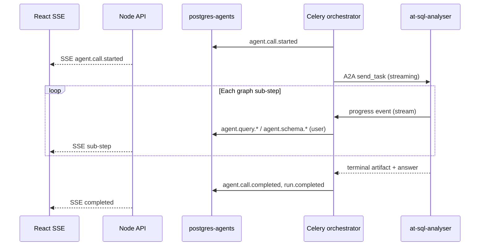

# Agent Run Live Events & Trace Resilience

- **Status:** Future enhancement (not implemented)
- **Owner:** Orchestration / Agents platform / Frontend
- **Scope:** `services/orchestrator`, `agents/at-sql-analyser`, `backend-services/api`, `frontend/web`
- **Related rules:** `010-security-by-design`, `000-core-engineering`, `030-frontend-react`, `040-python-langgraph-agents`
- **Related docs:** `design-planning/langfuse-observability-integration.md`, `design-planning/celeryWorkerPlan.md`

---

## 1. Problem & motivation

Agent runs already persist a unified, ordered event stream per `run_id` in `postgres-agents` (`agent_run_events`) and expose it to the UI via SSE (`GET /agent-runs/:runId/events`). Tool gateway hops emit `tool.call.*` incrementally; agent hops emit `agent.call.started` live, but **agent-internal progress** (`agent.schema.*`, `agent.query.*`, `agent.write.*`) is buffered inside the agent and only forwarded **after** the A2A call completes.

Symptoms observed in production:

- During a long agent run (~40s), the Activity trace shows only “Asking at-sql-analyser…” until a burst of sub-steps appears at the end.
- Users perceive “no tools running” even though MCP queries execute mid-run (events exist in DB, but arrive in one batch).
- Mixed planner paths (gateway `tool.call.*` + `data.analyse.read` agent) are **correctly ordered by `sequence`** once persisted, but **not progressively visible** for the agent leg.

The frontend trace model was improved to count agent-internal operations as tool activity and to auto-expand invocations with substeps (see `frontend/web/src/features/chat/traceModel.ts`, `RunTrace.tsx`). That fixes **display semantics**; this document covers **transport and emission timing**.

---

## 2. Goals / Non-goals

### Goals

1. **Live incremental agent sub-events** — Each `agent.query.started` / `agent.query.completed` (and schema/write analogues) is persisted and visible over SSE **while the agent is still running**, not only after `agent.call.completed`.
2. **Single run timeline** — All sources (orchestrator lifecycle, planner, tool gateway, agent dispatch, agent-internal MCP/capability steps) remain keyed by **`run_id`**, monotonic **`sequence`**, and `visibility = 'user'` where appropriate.
3. **Resilient client consumption** — SSE reconnect and late join continue to work via sequence cursor + `event.id` dedupe (existing `useAgentRunEvents.ts` behaviour); server-side ordering must remain strict.
4. **Security unchanged** — No new trust boundaries; payloads stay redacted/bounded (`safe_io`); no raw SQL, rows, or secrets in user events.
5. **Fail-soft observability** — Langfuse remains separate; streaming failures must not weaken authz or corrupt run state.

### Non-goals

- Replacing Postgres as the event ledger or moving the SSE poll endpoint to Redis.
- Streaming the **final LLM answer** token-by-token to the chat bubble (chat streaming is a separate product decision).
- Changing capability catalog / RBAC (e.g. `sales.products.forCustomer` is implemented separately).
- Enabling A2A push notifications on the agent card unless required by the chosen streaming protocol.

---

## 3. Current state (authoritative behaviour)

| Concern | Today | Primary files |
|--------|--------|----------------|
| Event persistence | `emit_event` → `agent_run_events` with per-run `sequence`, `visibility` filter for SSE | `services/orchestrator/src/nova_orchestrator/events.py`, `graph.py` |
| Tool gateway steps | `tool.call.started` / `.completed` emitted and committed per hop | `graph.py` `_run_tool_step` |
| Agent dispatch | `agent.call.started` committed **before** A2A; internal events loop **after** A2A returns | `graph.py` `_run_agent_step` (~660–751) |
| Agent buffering | `on_event` appends to `collected[]`; returned in terminal artifact `events` | `agents/at-sql-analyser/src/at_sql_analyser/server.py` |
| A2A client | Async transport, **`streaming=False`**, sync `asyncio.run(send_task)` from Celery | `agent_client.py` |
| Agent card | `streaming=False`, `pushNotifications=False` | `at-sql-analyser/server.py` `build_agent_card` |
| API → UI | Poll DB every ~1s, `event: ${type}`, JSON body | `agent-run.controller.ts` `streamEvents` |
| Frontend trace | Merges agent-internal ops as sub-steps; counts them in tool badge | `traceModel.ts`, `RunTrace.tsx` |

**Already correct (no work required for ordering/keying):**

- One `run_id` per user message; all events share that key.
- Causal order is preserved in the DB once written.
- Frontend dedupes by `event.id` and handles terminal run types.

**Gap:** agent-internal events are **late**, not **missing**.

---

## 4. Proposed architecture

### 4.1 Target flow (live agent sub-events)



### 4.2 Agent (`at-sql-analyser`)

1. Set **`streaming=True`** on `AgentCard` capabilities (and document the transport).
2. During `SqlAnalystExecutor.execute`, push progress on the A2A **`EventQueue`** / `TaskUpdater` as each `on_event` fires (not only into `collected[]` at the end).
   - Use typed, stable event type strings already in the catalog (`agent.query.started`, etc.).
   - Keep `collected[]` for the terminal artifact so the worker can still reconcile final state.
3. Ensure **fail-closed** behaviour: malformed or unauthorized tasks never emit user-visible progress.

### 4.3 Orchestrator worker

1. Extend **`AgentClient`** to consume **streaming** A2A responses:
   - For each streamed progress payload, call `emit_event(..., visibility="user")` + `session.commit()` (or short transaction per event — align with existing heartbeat / lock patterns).
   - Hold DB locks only as long as today’s `agent.call.started` / terminal commits; avoid holding a lock for the full 180s agent call.
2. Refactor `_run_agent_step` so internal events are **not** only replayed from `agent_result.events` after return; streamed events are the source of truth for live UI, with terminal artifact as reconciliation/backfill for gaps.
3. Add **idempotency** on streamed events (e.g. stable `event.id` or dedupe by `(run_id, type, sqlHash, sequence)` ) so reconnects do not duplicate rows.

### 4.4 API & frontend

- **API:** No contract change if event `type` + `payload` shape stay the same; optionally reduce poll interval or move to true push (out of scope unless needed).
- **Frontend:** Existing `buildTraceView` / `LiveRunTrace` should show sub-steps incrementally once events arrive mid-run; verify `defaultOpen` on running agent rows during live runs.

### 4.5 Optional follow-ups (same initiative, lower priority)

| Item | Rationale |
|------|-----------|
| Reduce SSE poll interval when run `status=running` | Faster UI without streaming backend |
| `agent.call.progress` catalog type | Reserved in enums but never emitted; either implement or remove from catalog |
| MSW / e2e fixtures | Replay interleaved tool + agent events with delays for UI regression |

---

## 5. Security & data handling

- Reuse **`safe_io`** (or equivalent) on every streamed payload before `emit_event`.
- Agent must not stream raw SQL, row payloads, or PII — same rules as today’s `collected` events (hashes, counts, capability ids only).
- Worker must not trust streamed content for **authorization**; Layer B gates remain on snapshot + capability id.
- Langfuse `tool_span` stays observability-only; user events stay in `agent_run_events`.

---

## 6. Implementation phases (suggested)

### Phase A — Spike & contract

- [ ] Confirm `a2a-sdk` streaming API for progress events (message shape, backpressure).
- [ ] Document event envelope for in-flight progress (reuse existing `type` + `payload` vs new wrapper).
- [ ] Decide per-event DB commit vs batched commits (latency vs load).

### Phase B — Agent streaming emitter

- [ ] `streaming=True` on agent card.
- [ ] Emit progress on `EventQueue` from `on_event` in `server.py`.
- [ ] Unit/integration tests: mock queue receives `agent.query.started` before terminal.

### Phase C — Worker streaming consumer

- [ ] `AgentClient` streaming mode + incremental `emit_event`.
- [ ] `_run_agent_step` lock/transaction strategy (no long-held row locks).
- [ ] Dedupe / reconcile with terminal `events[]` artifact.

### Phase D — Verification

- [ ] Docker e2e: run “who is the top customer” / “products for Mario” — sub-steps visible **before** `agent.call.completed`.
- [ ] SSE reconnect mid-run receives ordered backlog without duplicates.
- [ ] Parity: no change to `nova_authz` / capability catalog unless new event types added.

---

## 7. Acceptance criteria

1. While `at-sql-analyser` is executing a query, the UI Activity panel shows “Querying data…” (or merged sub-step) **before** the final answer appears.
2. A run that uses **both** `tool.call.*` and `agent.call.*` shows interleaved steps in **strict `sequence` order** in DB and UI.
3. No regression: completed runs still show full trace in `RunTracePanel` after refresh.
4. Security review: no new user-visible fields containing SQL text, row bodies, or tokens.
5. CI: orchestrator + agent tests cover streaming happy path and deny/malformed task (no spurious events).

---

## 8. Risks & mitigations

| Risk | Mitigation |
|------|------------|
| Long DB transactions during agent call | Emit events in short transactions; keep A2A outside locks (today’s pattern for `send_task`) |
| Duplicate events on retry | Idempotency keys on stream frames or dedupe in worker |
| Celery + `asyncio.run` per chunk | Consider persistent event loop per worker process if overhead is high |
| A2A streaming not supported by all agents | Feature-flag per agent card; fall back to batch mode |
| Increased write load on `agent_run_events` | Acceptable for low QPS; batch if needed later |

---

## 9. Related completed work (context)

- **Trace UI (2026-05):** Agent-internal MCP steps counted as tools; sub-steps merged start→terminal; invocations with activity auto-expand (`traceModel.ts`, `RunTrace.tsx`).
- **`sales.products.forCustomer`:** One-shot capability for customer product purchase history (`capabilities.ts`, `capability-executor.ts`, planner guide).

---

## 10. Commands & references

Regenerate auth parity after any capability catalog change:

```bash
cd backend-services
npm run build -w @nova/shared && npm run rbac:export -w @nova/shared
cd ..
python services/orchestrator/scripts/generate_nova_authz.py
python services/orchestrator/scripts/generate_nova_authz.py --check
```

Key code paths:

- `services/orchestrator/src/nova_orchestrator/graph.py` — `_run_agent_step`, `_run_tool_step`
- `services/orchestrator/src/nova_orchestrator/agent_client.py` — `send_task`, `streaming=False`
- `agents/at-sql-analyser/src/at_sql_analyser/server.py` — `collected`, `_terminal`
- `backend-services/api/src/modules/agent-runs/agent-run.controller.ts` — `streamEvents`
- `frontend/web/src/features/chat/useAgentRunEvents.ts` — SSE client
