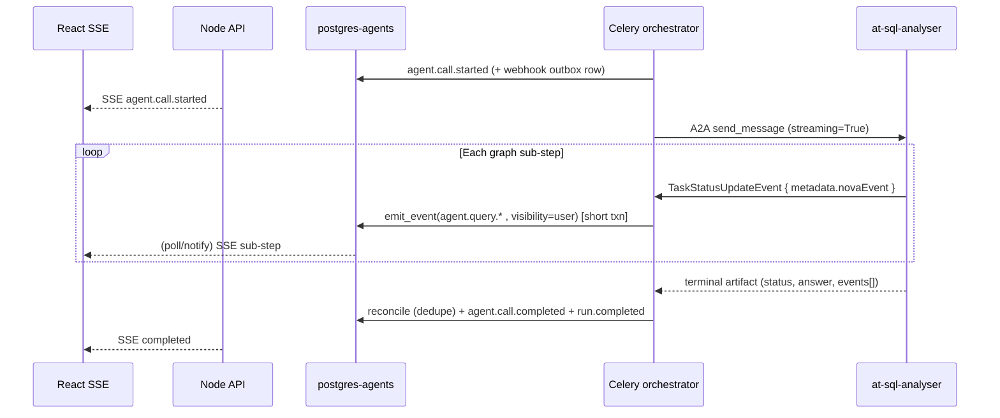

# Agent Run Live Events & Trace Resilience

- **Status:** Future enhancement (not implemented)
- **Owner:** Orchestration / Agents platform / Frontend
- **Scope:** `agents/orchestrator`, `agents/at-sql-analyser`, `backend-services/api`, `frontend/web`
- **Related rules:** `010-security-by-design`, `000-core-engineering`, `020-backend-node-typeorm`, `030-frontend-react`, `040-python-langgraph-agents`
- **Related docs:** `design-planning/langfuse-observability-integration.md`, `design-planning/celeryWorkerPlan.md`, `design-planning/sqlAnalystAgentPlan.md`

> **Path note:** the orchestrator/worker code lives under `agents/orchestrator/src/nova_orchestrator/`, not `services/orchestrator`. All references below use the real tree.

---

## 1. Problem & motivation

Agent runs already persist a unified, ordered event stream per `run_id` in `postgres-agents` (`agent_run_events`) and expose it to the UI via SSE (`GET /agent-runs/:runId/events`). Tool gateway hops emit `tool.call.*` incrementally; agent hops emit `agent.call.started` live, but **agent-internal progress** (`agent.schema.*`, `agent.query.*`, `agent.write.*`) is buffered inside the agent and only forwarded **after** the A2A call completes.

Concretely (verified in code):

- `agents/at-sql-analyser/.../server.py` builds an `on_event` callback that does two things per sub-step: scrub to the tracer **and** `collected.append(...)`. It never pushes to the A2A `EventQueue` mid-run. The `collected[]` list is returned only in the terminal artifact (`_terminal` → `DataPart.events`).
- `agents/orchestrator/.../graph.py` `_run_agent_step` (function at line ~447) commits `agent.call.started` (line ~536), runs the A2A call **outside the DB transaction** (line ~559), then on return replays `agent_result.events` into `emit_event` (loop at line ~620). So sub-steps land in one burst at the end.
- `agents/orchestrator/.../agent_client.py` creates the A2A client with `streaming=False` (line ~164) and drives it from Celery via `asyncio.run(self._send(...))` (line ~142).
- `agents/at-sql-analyser/.../server.py` `build_agent_card` advertises `AgentCapabilities(streaming=False, push_notifications=False)` (line ~114).

Symptoms observed in production:

- During a long agent run (~40s), the Activity trace shows only “Asking at-sql-analyser…” until a burst of sub-steps appears at the end.
- Users perceive “no tools running” even though MCP queries execute mid-run (events exist in the agent's `collected[]`, but arrive in one batch).
- Mixed planner paths (gateway `tool.call.*` + `data.analyse.read` agent) are **correctly ordered by `sequence`** once persisted, but **not progressively visible** for the agent leg.

The frontend trace model already merges agent-internal ops as sub-steps and counts them in the tool badge (`frontend/web/src/features/chat/traceModel.ts` `buildTraceView`, `summarizeEvents`; `RunTrace.tsx`). That fixes **display semantics**; this document covers **transport and emission timing**.

**Gap restated:** agent-internal events are **late, not missing**. The fix is to move the agent → worker → DB → SSE hop from "after the A2A call returns" to "while the A2A call is in flight", without weakening ordering, redaction, authorization, or the webhook outbox contract.

---

## 2. Goals / Non-goals

### Goals

1. **Live incremental agent sub-events** — Each `agent.query.started` / `agent.query.completed` (and schema/write analogues) is persisted and visible over SSE **while the agent is still running**, not only after `agent.call.completed`.
2. **Full-fidelity audit firehose to the webhook** — The owner's configured webhook receives **every step of every run**: each agent **graph-node** execution (start + result), each **tool / MCP / capability invocation** with its bounded input and output, and each **RBAC decision** (the Layer A planner gate, the Layer B dispatch gate, and the agent-side re-gate) for both **allow and deny**. Nothing material is dropped from the audit trail. (How "everything" coexists with the PII/secret rules: §5.2 + §6.)
3. **Single run timeline** — All sources (orchestrator lifecycle, planner, tool gateway, agent dispatch, agent-internal MCP/capability steps, RBAC decisions) remain keyed by **`run_id`**, monotonic **`sequence`** (from `next_sequence`), with an explicit `visibility` per event.
4. **Resilient client consumption** — SSE reconnect and late join continue to work via `Last-Event-ID`/`afterSequence` cursor + `event.id` dedupe (existing `useAgentRunEvents.ts` behaviour); server-side ordering must remain strict.
5. **Exactly-once semantics across reconnect/retry** — A streamed sub-event and its terminal-artifact twin must **not** produce duplicate `agent_run_events` rows; A2A stream reconnects must not double-emit; each webhook event is delivered idempotently.
6. **Two-tier visibility, one ledger** — Every step is written once to `agent_run_events` with the right `visibility`. The **browser SSE** stream stays `user`-only (no raw authz reasons / internals exposed to the UI); the **owner webhook** is an authenticated server-to-server audit channel that may additionally receive `internal` and `security` events. Both are fed from the same ordered ledger.
7. **Security preserved** — No new trust boundaries; **all** payloads (user, internal, security) pass `safe_io` redaction/bounding **in the worker** before persistence; no secrets/tokens ever appear; raw SQL text and raw row bodies stay hashed/bounded by default (entitlement-gated opt-in only); streamed content is **never** trusted for authorization.
8. **Fail-soft observability** — Langfuse remains separate; streaming/webhook failures must not weaken authz, corrupt run state, or block the terminal answer.

### Non-goals

- Replacing Postgres as the event ledger.
- Streaming the **final LLM answer** token-by-token to the chat bubble (separate product decision).
- Changing the **capability** catalog or the RBAC policy itself (e.g. `sales.products.forCustomer` is implemented separately). This initiative **does** add new **event-type** entries (`agent.node.*`, `authz.allowed`) and a `WebhookAuthConfig` subscription field, but no new capabilities, permissions, or scopes.
- Enabling A2A push notifications (`pushNotifications=True`) unless the chosen streaming protocol requires it (it does not — streaming uses the same request connection).

---

## 3. Current state (authoritative behaviour)

| Concern | Today | Primary files |
|--------|--------|----------------|
| Event persistence | `emit_event` → `agent_run_events` with per-run `sequence` (`next_sequence` = `max+1`), `visibility` filter for SSE; **also enqueues a `WebhookDelivery` for every `user` event** (transactional outbox) | `agents/orchestrator/.../events.py` |
| Tool gateway steps | `tool.call.started` / `.completed` emitted and committed per hop | `graph.py` `_run_tool_step` |
| Agent dispatch | `agent.call.started` committed **before** A2A; internal events replayed **after** A2A returns | `graph.py` `_run_agent_step` (~447–700; replay loop ~620) |
| Agent buffering | `on_event` (sync sink) appends to `collected[]`; returned in terminal artifact `events` | `agents/at-sql-analyser/.../server.py` (`on_event` ~256), `harness/graph.py` (`emit` calls) |
| A2A client | Async transport, **`streaming=False`**, sync `asyncio.run(send_task)` from Celery; 180s read budget, 10s connect ceiling | `agent_client.py` (~142, ~164) |
| Agent card | `streaming=False`, `push_notifications=False` | `at-sql-analyser/.../server.py` `build_agent_card` (~114) |
| API → UI | Poll DB every `SSE_POLL_INTERVAL_MS = 1000`ms, `id:`/`event:`/`data:` frames; resume via `Last-Event-ID` | `agent-run.controller.ts` `streamEvents` |
| API event read | `getEventBatch` → `listUserEventsAfter(runId, afterSequence, MAX_EVENT_BATCH)`, ownership-checked | `agent-run.service.ts` |
| Frontend trace | Merges agent-internal ops as sub-steps; counts them in tool badge; dedupes by `event.id` | `traceModel.ts`, `RunTrace.tsx`, `useAgentRunEvents.ts` |

**Already correct (no work required for ordering/keying):**

- One `run_id` per user message; all events share that key.
- Causal order is preserved in the DB once written (`sequence` is monotonic per run; one worker processes a run's steps sequentially).
- Frontend dedupes by `event.id`, handles terminal `run.*` types, and resumes from the last sequence on reconnect.
- The event-type catalog (`backend-services/packages/database/src/agents/agent-enums.ts` `AGENT_EVENT_TYPES`) already contains every `agent.*` sub-event type, so **no catalog/enum migration is required** for streaming the existing types.

**Already-present building blocks for streaming:**

- The agent already constructs a `TaskUpdater` over the `EventQueue` (`_make_updater`) and uses `updater.submit()` / `start_work()` / `add_artifact()` / `complete()` — the queue exists; we only need to push intermediate frames.
- The worker already iterates the A2A response (`async for event in client.send_message(message)` in `_send`); with `streaming=True` this loop receives intermediate frames, not just the terminal one.
- `_coerce_events` already treats agent-returned events as **untrusted** typed `{type, payload}` — the same coercion applies to streamed frames.

**Gaps for the full audit firehose (new work):**

- **RBAC decisions are partially evented.** Today the worker emits `authz.denied` (`visibility="security"`) only on **deny**, and records **both** allow and deny in `agent_audit_log` via `record_audit` (`evaluate_capability` decisions in `graph.py`; the snapshot-integrity gate in `tasks.py`; the agent's own Layer-B `authorize` re-gate in `at-sql-analyser`). **Allow decisions are never evented**, and `security` events are never delivered to the webhook (`emit_event` only enqueues a `WebhookDelivery` for `visibility="user"`). To "send back every RBAC check", we must (a) emit an `authz.allowed`/`authz.checked` event for every gate, and (b) let the webhook receive `security`/`internal` visibility (§5.2, §6).
- **Graph-node execution is not evented.** The agent only emits a curated set of `on_event`s (`agent.schema.loaded`, `agent.query.*`, `agent.write.*`); individual LangGraph node entries/exits are not surfaced. "Every node execution" needs `agent.node.started`/`agent.node.completed` instrumentation (node name + bounded metadata).
- **Webhook delivery is gated on `user` visibility only** (`enqueue_webhook_if_configured` is called from the `visibility == "user"` branch of `emit_event`). A full firehose requires widening this for the webhook channel without widening the browser SSE channel.

---

## 4. Proposed architecture

### 4.1 Target flow (live agent sub-events)



### 4.2 Agent (`at-sql-analyser`) — stream the sub-events

1. Set **`streaming=True`** on `AgentCapabilities` in `build_agent_card`. Keep `push_notifications=False` (streaming rides the same request connection; push notifications add a callback trust boundary we do not need).
2. **Make the event sink stream-capable.** `on_event` is currently a synchronous `EventSink` invoked from `async` graph nodes (`harness/graph.py` `emit(...)`). Introduce an async-aware emitter that, in addition to `collected.append(...)`, schedules an enqueue onto the `EventQueue` via the `TaskUpdater`:
   - Emit each sub-step as a `TaskStatusUpdateEvent` with `state = working`, `final = False`, and a typed envelope in `metadata` (e.g. `metadata = {"novaEvent": {"type": "agent.query.started", "payload": {...}, "agentSeq": <int>}}`).
   - Preserve **strict order**: the `EventQueue` is FIFO; enqueue in the same order `on_event` fires. Add a monotonic `agentSeq` per task so the worker can order/dedupe deterministically even if transport reorders.
   - Because nodes are `async`, the sink can be an `async` callback awaited inline, or a sync shim that does `event_queue.enqueue_event(...)` (non-blocking). Decide in Phase A based on the `a2a-sdk` queue API; do **not** block a node on network IO.
3. **Keep `collected[]`** for the terminal artifact — it remains the reconciliation/backfill source of truth for any frame the worker missed (reconnect, dropped frame).
4. **Fail-closed unchanged:** malformed/unauthorized tasks (`_parse_task` returns `None`, snapshot/Layer-B denials) must **never** enqueue user-visible progress. Denials stay as today (`agent.task.denied`, terminal `reject`).
5. **Redaction stays the agent's invariant:** the agent already emits only hashes/counts/capability ids (`sqlHash`, `rowCount`, `capability`) — never raw SQL or rows. Streaming changes *when*, not *what*.

### 4.3 Orchestrator worker — consume the stream incrementally

1. **`AgentClient` streaming mode.** Add a streaming path (or a `stream=True` flag on `send_task`) that:
   - Creates `ClientConfig(streaming=True, ...)`.
   - Iterates `client.send_message(message)`; for each **non-final** `TaskStatusUpdateEvent`, extracts `metadata.novaEvent`, coerces it with the same untrusted-input discipline as `_coerce_events` (drop anything not `{type: str, payload: dict}`), and hands it to a **callback** supplied by `_run_agent_step` (so the DB write stays in the worker, not the transport layer).
   - Treats the final task/artifact exactly as today (`_parse_result`).
2. **Per-event persistence in short transactions.** In `_run_agent_step`, the streaming callback opens a short session, calls `emit_event(..., visibility="user")` with `safe_io(payload)`, updates `run.last_heartbeat_at`, and commits — mirroring today's per-hop commit pattern. **No DB lock is held across the A2A call** (the network hop stays outside the transaction, exactly as the current code already does for `send_task`).
   - The worker is sync/Celery but the stream is consumed inside `asyncio.run`. Do DB work via `asyncio.to_thread(...)` (the same pattern the agent uses for `snapshot.fetch_verified`) so the event loop is never blocked on a sync DB driver.
3. **Source-of-truth + reconciliation.** Streamed events are the live source for the UI. After the call returns, the existing replay loop (line ~620) becomes a **reconcile/backfill**: only emit a terminal-artifact event if its idempotency key has not already been persisted (see §4.6). This guarantees no gaps (missed frame ⇒ backfilled) and no duplicates (already-streamed ⇒ skipped).
4. **Heartbeat benefit (functional):** because each streamed sub-event bumps `run.last_heartbeat_at`, a long agent call now produces liveness signal throughout, improving any stuck-run reaper / watchdog instead of looking idle for ~40s.

### 4.4 Idempotency & ordering (new, required)

Today `emit_event` derives `sequence` from `max+1` and assigns a random `event.id`; there is **no idempotency key on `agent_run_events`**. Streaming + reconnect + terminal-artifact replay create three ways to double-write the same logical sub-event. Mitigation:

- **Deterministic dedupe key per agent sub-event:** `(run_id, capability_id, index, agentSeq)` or a stable hash thereof. The agent supplies `agentSeq` (monotonic per task). The worker computes the key before `emit_event`.
- **Enforce at the DB:** add a nullable `dedupe_key` column on `agent_run_events` with a **unique partial index** `WHERE dedupe_key IS NOT NULL`. `emit_event` (or a thin wrapper used only for agent sub-events) does an idempotent insert (`ON CONFLICT DO NOTHING`); on conflict, skip the webhook enqueue too.
- **Reconciliation pass** uses the same key, so the terminal `events[]` only fills genuine gaps.
- Lifecycle events (`run.*`, `agent.call.*`, `tool.call.*`) keep their current behaviour (no dedupe key needed — they are emitted exactly once by the worker).

### 4.5 API & frontend

- **API:** No contract change — event `type` + `payload` shape are unchanged, so `streamEvents` and `getEventBatch` work as-is. Two scalability options (see §5.1): (a) keep the 1s poll but tune it for `status=running`; (b) move to push (Postgres `LISTEN/NOTIFY` or Redis pub/sub) to cut per-client polling load.
- **Frontend:** No change required. `buildTraceView` already opens an agent invocation on `agent.call.started`, appends `agent.*` sub-steps to `openAgent.substeps`, and merges `*.started` → terminal in `runningOps`. Once events arrive mid-run, sub-steps render incrementally. **Verify** `defaultOpen` / auto-expand behaviour in `RunTrace.tsx` for a *running* agent row during a live run (today it was validated mostly against completed runs).

### 4.6 Failure & edge handling

| Scenario | Behaviour |
|----------|-----------|
| A2A stream drops mid-call | Worker catches it, marks `agent.call.failed` as today; already-streamed sub-events stay (they describe real work). If the agent later returns a terminal artifact, reconcile backfills the rest. |
| Frame received but DB commit fails | Log internal-visibility only; do **not** abort the run. Terminal-artifact reconcile is the safety net. |
| Run canceled during streaming | Propagate cancellation to the agent via A2A `cancel` (the agent already implements `SqlAnalystExecutor.cancel`). Worker still checks `cancel_requested` at step boundaries (existing behaviour) as a backstop. |
| Agent advertises `streaming=False` | Worker falls back to today's batch path (feature-detected from the resolved Agent Card — the worker already resolves the card per call). |
| Duplicate frame on reconnect | Dropped by the §4.4 dedupe key. |

### 4.7 Graph-node execution events (new)

To surface **every node execution in every agent**, instrument the LangGraph DAG generically rather than hand-adding `on_event` calls per node:

- Wrap each node (or use a LangGraph node-callback / the existing Langfuse `CallbackHandler` seam) so entry emits `agent.node.started {"node": <name>, "iteration": n}` and exit emits `agent.node.completed {"node": <name>, "ms": <duration>, "outcome": "ok|error"}`.
- **Bounded metadata only:** node name, iteration counter, duration, and a small typed outcome. **No** raw state, prompt text, SQL, or rows in node events — those are summarized by the existing `agent.query.*`/`agent.write.*` events (with hashes/counts) which remain the canonical I/O record.
- These are agent-internal, so they ride the **same streaming envelope** as §4.2 (`TaskStatusUpdateEvent.metadata.novaEvent`) and are persisted by the worker like any other sub-event.
- New event types `agent.node.started` / `agent.node.completed` must be added to `AGENT_EVENT_TYPES` (and the worker/frontend kept tolerant of unknown types — `describeEvent` already returns `null` for unknown types, so the UI degrades gracefully).

### 4.8 RBAC decision events (new)

Emit a decision event at **every** authorization gate, for **allow and deny**, so the audit channel sees every access check:

- **Orchestrator gates** (`graph.py` `_run_agent_step` / `_run_tool_step`, `tasks.py` snapshot-integrity gate): after `evaluate_capability(...)`, emit `authz.allowed` on allow (today only `authz.denied` is emitted) with `{capability, requiredPermission, decision, reasonCode, actor}`. Keep the existing `record_audit(...)` write to `agent_audit_log` as the authoritative, immutable trail — the event is the **stream/webhook projection** of that audit row, not a replacement.
- **Agent-side re-gate** (`at-sql-analyser` `authorize(...)` in `_run_read`/`_run_write` and per-capability dispatch): emit `agent.authz.allowed` / reuse `agent.task.denied`, carried over the streaming envelope so the agent's independent Layer-B verdicts are also in the firehose.
- **Visibility:** RBAC events are `visibility="security"`. They flow to the **webhook** (owner's authenticated audit endpoint) but **not** to the browser SSE stream (see §6 — avoids handing authz reason codes to the client, which aids permission probing).
- **Payload discipline:** capability id, required permission/scope, decision, a stable `reasonCode` (enum, not free text), and the actor (`nova-celery-worker` / agent name). Never the token, the snapshot contents, the user's full role set, or PII.

### 4.9 Webhook channel scope (full firehose) (new)

Today `emit_event` only enqueues a webhook delivery in the `visibility == "user"` branch. To deliver "everything that happens":

- Move the `enqueue_webhook_if_configured(...)` call so it runs for **every** visibility, **gated by the owner's `WebhookAuthConfig` subscription scope** (new field, default = all visibilities) rather than hard-coded to `user`.
- `WebhookAuthConfig` gains an explicit `visibility_scope` (subset of `{user, internal, security}`, default all) and an optional `event_type_allowlist` (default = all). This makes the firehose **opt-out granular** instead of silently fixed.
- The browser SSE path is unchanged: `getEventBatch` / `listUserEventsAfter` still filter to `visibility='user'`. The two channels diverge **only** in which visibilities they carry; ordering and redaction are identical.
- Delivery stays idempotent via the existing unique `(event_id, destination_url)` index; volume is controlled by coalescing (§5.2).

### 4.10 Optional follow-ups (same initiative, lower priority)

| Item | Rationale |
|------|-----------|
| Push delivery (LISTEN/NOTIFY or Redis pub/sub) for SSE | Removes the 1s poll latency and the per-client-per-second DB query; see §5.1 |
| Adaptive poll interval (shorter while `status=running`, stop on terminal) | Cheap latency win without a push backend |
| Emit `agent.call.progress` (already in `AGENT_EVENT_TYPES`) for a coarse % / phase | Currently reserved but never emitted — either implement as a milestone heartbeat or remove from the catalog to avoid dead types |
| MSW / e2e fixtures replaying interleaved tool + agent events with delays | UI regression coverage for live ordering and auto-expand |

---

## 5. Scalability

### 5.1 SSE delivery path (read side)

Today each connected client polls `getEventBatch` every 1s (`SSE_POLL_INTERVAL_MS`). Streaming **increases the number of rows per run** but not the poll rate, so the immediate impact is bounded. At higher concurrency the poll model costs `N_clients × 1 query/s` against `postgres-agents`. Recommendations:

- **Short term:** keep polling; ensure `listUserEventsAfter` is backed by a composite index on `(run_id, sequence)` filtered to `visibility='user'` so each poll is an index range scan, and keep `MAX_EVENT_BATCH` bounded (already the case).
- **Medium term (optional):** replace the per-client timer with a single per-process subscriber using Postgres `LISTEN/NOTIFY` (the worker `NOTIFY`s on commit) or Redis pub/sub keyed by `run_id`. SSE handlers wake on notify and read only the new tail. This converts O(clients) polling into O(events) fan-out.
- Keep the `X-Accel-Buffering: no` + keep-alive comment frames (already present) so proxies don't buffer the stream.

### 5.2 Webhook outbox volume under a full firehose (write side) — important

**Product decision (resolved): the webhook receives the full firehose** — every node execution, every tool/MCP/capability call with bounded I/O, and every RBAC decision (`user` + `internal` + `security`). That is a large multiplier: a run that previously produced ~3 webhook deliveries can now produce dozens (schema load, each query start/complete, each node start/complete, each authz check). Because we cannot drop events without violating the audit requirement, volume is controlled by **batching, not filtering**:

- **Per-run coalescing (primary control):** the dispatcher batches all pending deliveries for a `run_id` within a short window (e.g. 100–250ms, or up to N events) into **one signed HTTP POST** carrying an ordered `events[]` array. This keeps the audit complete while cutting HTTP requests by 10–50×. Each event keeps its own `sequence`/`id` for receiver-side ordering and dedupe.
- **Bounded payloads:** `safe_io` already bounds each event (`_MAX_STRING`, `_MAX_ITEMS`, `_MAX_DEPTH`); cap the batch body size and split into multiple deliveries if exceeded.
- **Idempotent + ordered:** the unique `(event_id, destination_url)` index plus an ascending `sequence` per run lets the receiver reconcile and dedupe; §4.4's skip-on-conflict prevents re-enqueue.
- **Backpressure / dead-letter:** keep the existing retry + `dead_letter` status (`WEBHOOK_DELIVERY_STATUSES`); a slow/failing receiver must never block run execution (outbox is async). Surface lag via metrics.
- **Subscription scope as opt-out, not default-drop:** `WebhookAuthConfig.visibility_scope` / `event_type_allowlist` (§4.9) let an owner who does **not** need the full firehose narrow it; the **default is all events** to satisfy the "send back everything" requirement.
- **Write amplification to `agent_run_events`:** node + authz events also multiply ledger rows. This is bounded naturally by the agent's `max_iterations` / `max_queries` guards; ensure `(run_id, sequence)` and the `dedupe_key` partial index keep inserts/reads cheap, and consider table partitioning / retention by `created_at` if long-term volume grows.

### 5.3 Worker write load & transactions

- **Short transactions per event** (open → `emit_event` → commit) keep lock windows tiny and never span the A2A hop. Acceptable at current low QPS.
- **Micro-batching option:** if sub-event rate is high (e.g. many fast queries), flush every *K* events or every *T* ms instead of per event, trading a little latency for fewer transactions and webhook rows. Keep batches small enough that the UI still feels live (≤250ms).
- **Persistent event loop:** `asyncio.run` per `send_task` is fine for one streamed call per step. Only revisit (persistent loop per worker process) if profiling shows loop-setup overhead matters.

---

## 6. Security & data handling

**"Send back everything" within the security rules.** The firehose is about *completeness of the timeline*, not bypassing redaction. `010-security-by-design` forbids secret/PII leakage in logs, errors, traces, **and webhook payloads**, so "everything" is reconciled as follows:

- **`safe_io` on every event, every visibility.** Reuse `safe_io` (in `events.py`) on **every** payload — `user`, `internal`, **and `security`** — **in the worker** before `emit_event` (today only the user-replay loop does this, `graph.py` ~623). The agent is never the redaction boundary of record. Secret-keyed values are always `[redacted]`; strings/collections/depth are bounded.
- **Secrets/tokens: never, on any channel.** No bearer tokens, client secrets, JWTs, cookies, snapshot signatures, or the user's full role set appear in any event — webhook included. This is non-negotiable and unchanged.
- **Raw SQL text & row bodies: hashed/bounded by default.** Tool/agent I/O is delivered, but SQL is represented by `sqlHash` and reads by `rowCount`/`truncated` (today's `harness/graph.py` behaviour). Shipping literal SQL or row data — which may contain PII — to a webhook is an **explicit, entitlement-gated opt-in** (`WebhookAuthConfig` flag, owner must hold the data-layer entitlement and accept PII handling), **never** the default. This is the one place "everything" is deliberately bounded; call it out with the owner.
- **Two-tier visibility (the firehose split):**
  - **Browser SSE** stays `user`-only (`getEventBatch` filters `visibility='user'`). RBAC reason codes and internals are **not** sent to the browser — exposing them aids permission enumeration/probing and they are not needed for the UI trace.
  - **Owner webhook** is an authenticated, owner-configured, signed server-to-server channel scoped to that owner's own runs; it may additionally carry `internal` + `security` (incl. `authz.allowed`/`authz.denied`) per `visibility_scope`. RBAC events use a stable `reasonCode` enum (not free text) so denial details can't be data-mined.
- **Audit log remains authoritative.** `record_audit` → `agent_audit_log` is the immutable RBAC trail; the `authz.*` events are its stream/webhook projection, not its replacement. Webhook delivery failures never lose the audit row.
- **Streamed content is display-only and untrusted.** It must not influence authorization. Layer B gates remain on the verified snapshot + capability id, evaluated **before** dispatch in `_run_agent_step`/`tasks.py` and re-asserted independently inside the agent. A forged `agent.write.completed`/`authz.allowed` frame cannot change run state, authz, or the terminal outcome (status derives from `_parse_result`, not from frames; authz from `evaluate_capability`, not from emitted events).
- **Frame metadata is parsed as data, never instructions** (consistent with `_parse_task`). `metadata.novaEvent` is coerced (`{type: str, payload: dict}`); anything else is dropped.
- Ownership is enforced **before any SSE bytes** (`requireOwnedRun` in `getEventBatch`); the webhook is scoped to the owner via `WebhookAuthConfig.owner_subject`. No cross-owner data ever crosses either channel.
- Langfuse `tool_span` stays observability-only; user/internal/security events stay in `agent_run_events`.
- **Re-run auth parity generation** after adding the new event types (`agent.node.*`, `authz.allowed`, `agent.authz.allowed`) to `AGENT_EVENT_TYPES` (see §11).

---

## 7. Implementation phases (suggested)

### Phase A — Spike & contract

- [ ] Confirm the `a2a-sdk` streaming API: exact type for intermediate frames (`TaskStatusUpdateEvent`), how the agent enqueues them (`TaskUpdater.update_status` / `EventQueue.enqueue_event`), and how the client surfaces them in the `async for` loop. Confirm backpressure semantics.
- [ ] Finalize the in-flight event envelope: reuse `{type, payload}` carried in `TaskStatusUpdateEvent.metadata.novaEvent` (+ `agentSeq`).
- [ ] **Decided:** webhook = **full firehose** (`user` + `internal` + `security`), default-all, volume controlled by per-run coalescing (§5.2), not by dropping events.
- [ ] Decide per-event commit vs micro-batched commit (§5.3) and the webhook batch window / max batch size.
- [ ] Decide the dedupe key shape and the `agent_run_events` migration (§4.4).
- [ ] Catalog new event types: `agent.node.started`, `agent.node.completed`, `authz.allowed`, `agent.authz.allowed`; define the `reasonCode` enum for authz events.
- [ ] Decide the literal-SQL / raw-row opt-in contract (entitlement-gated `WebhookAuthConfig` flag) — default OFF (§6).

### Phase B — Agent streaming emitter + node/authz events

- [ ] `streaming=True` on the Agent Card (`build_agent_card`).
- [ ] Make `on_event` stream-capable: enqueue each sub-step as a `working` `TaskStatusUpdateEvent` with the typed envelope + `agentSeq`, while still appending to `collected[]`.
- [ ] Add generic `agent.node.started`/`agent.node.completed` instrumentation (node name + bounded metadata; no raw state/SQL/rows).
- [ ] Emit `agent.authz.allowed` (and keep `agent.task.denied`) for the agent-side Layer-B re-gate.
- [ ] Unit/integration tests: a mocked queue receives `agent.query.started` and `agent.node.*` **before** the terminal artifact; malformed/denied tasks emit **no** progress frames.

### Phase C — Worker streaming consumer + RBAC events + webhook scope

- [ ] `AgentClient` streaming mode + a per-frame callback into `_run_agent_step`.
- [ ] `_run_agent_step` short-transaction emit with `safe_io` (all visibilities), `asyncio.to_thread` DB writes, heartbeat bump; no long-held row locks.
- [ ] Emit `authz.allowed` on every orchestrator allow gate (`graph.py`, `tasks.py`), keeping `record_audit`.
- [ ] Widen `enqueue_webhook_if_configured` to run for every visibility, gated by `WebhookAuthConfig.visibility_scope` (default all); add per-run coalescing in the dispatcher.
- [ ] Idempotent insert + unique partial index migration; terminal-artifact loop becomes reconcile/backfill.

### Phase D — Verification

- [ ] Docker e2e: run “who is the top customer” / “products for Mario” — sub-steps + node events visible **before** `agent.call.completed`.
- [ ] Webhook receives the **full ordered firehose** (node executions, tool I/O, allow+deny RBAC checks) for one run; assert no secrets/tokens and SQL/rows are hashed (default).
- [ ] Browser SSE for the same run contains **only** `user` events (no `authz.*`/`internal`).
- [ ] SSE reconnect mid-run receives ordered backlog with **no duplicates** (validates §4.4).
- [ ] Stream-drop / commit-failure: terminal reconcile backfills missing sub-events; run still completes.
- [ ] Cancel mid-stream propagates to the agent and ends the run cleanly.
- [ ] Webhook batch coalescing measured; per-run HTTP POST count stays bounded while event coverage is 100%.
- [ ] Parity: `nova_authz` regenerated and `--check` clean after adding the new event types.

---

## 8. Acceptance criteria

1. While `at-sql-analyser` is executing a query, the UI Activity panel shows “Querying data…” (or the merged sub-step) **before** the final answer appears.
2. A run that uses **both** `tool.call.*` and `agent.call.*` shows interleaved steps in **strict `sequence` order** in DB and UI.
3. **No duplicate events** when a client reconnects mid-run or when the terminal artifact replays (dedupe key holds).
4. No regression: completed runs still show the full trace via `getRunTrace` / `RunTracePanel` after refresh.
5. **Full firehose to the webhook:** for a representative run the webhook receives every graph-node execution, every tool/MCP/capability call with bounded input+output, and every RBAC decision (allow **and** deny) for the orchestrator gates and the agent re-gate — ordered by `sequence`, idempotent, and coalesced into bounded batches.
6. **Two-tier visibility holds:** the browser SSE stream for that same run contains **only** `user` events (no `authz.*`/`internal`/`security`).
7. **Redaction holds on every channel:** no event (user/internal/security, SSE or webhook) contains tokens/secrets; SQL is `sqlHash`, reads are `rowCount` — raw SQL/rows only ever appear under the explicit entitlement-gated opt-in.
8. Security review: streamed/webhook frames never affect authz or terminal status; authz events are a projection of `agent_audit_log`, which remains authoritative.
9. CI: orchestrator + agent tests cover the streaming happy path, node/authz event emission, reconnect/dedupe, webhook coalescing, and deny/malformed task (no spurious progress).

---

## 9. Risks & mitigations

| Risk | Mitigation |
|------|------------|
| Long DB transactions during agent call | Emit in short transactions; keep the A2A hop outside locks (already today's pattern for `send_task`). |
| Duplicate events on retry/reconnect/replay | Deterministic dedupe key + unique partial index + idempotent insert (§4.4). |
| Webhook volume explosion under full firehose | Per-run coalescing into batched signed POSTs + bounded payloads + dead-letter; skip enqueue on dedupe conflict (§5.2). Events are batched, never dropped. |
| RBAC reason codes leaking to the browser / enabling probing | `security` events go to the webhook only, never the browser SSE; stable `reasonCode` enum, not free text (§4.8, §6). |
| PII in raw rows/SQL reaching the webhook | Default redaction (hashes/counts); literal SQL/rows are an entitlement-gated opt-in, off by default (§6). |
| Per-client SSE polling cost at scale | Index-backed tail reads now; LISTEN/NOTIFY or Redis pub/sub later (§5.1). |
| Celery + `asyncio.run` per call / blocking the loop on sync DB | DB writes via `asyncio.to_thread`; consider a persistent loop per worker only if profiling demands. |
| A2A streaming unsupported by an agent | Feature-detect from the resolved Agent Card; fall back to batch mode. |
| Sync `on_event` called from async nodes | Use a non-blocking enqueue (or awaited async sink); never block a node on network IO. |
| Forged/buggy stream frames | Untrusted coercion + display-only; authz/terminal status derived from snapshot + `_parse_result`, never from frames. |

---

## 10. Related completed work (context)

- **Trace UI (2026-05):** Agent-internal MCP steps counted as tools; sub-steps merged start→terminal; invocations with activity auto-expand (`traceModel.ts`, `RunTrace.tsx`).
- **Webhook transactional outbox:** `emit_event` writes a `WebhookDelivery` per `user` event in the same transaction (`events.py`); a separate dispatcher delivers with a unique `(event_id, destination_url)` index for idempotency. This document's §5.2 must be honoured so streaming does not regress outbox volume.
- **`sales.products.forCustomer`:** One-shot capability for customer product purchase history (`capabilities.ts`, `capability-executor.ts`, planner guide).

---

## 11. Commands & references

Regenerate auth parity after any capability catalog change (only needed if new event/capability types are introduced):

```bash
cd backend-services
npm run build -w @nova/shared && npm run rbac:export -w @nova/shared
cd ..
python agents/orchestrator/scripts/generate_nova_authz.py
python agents/orchestrator/scripts/generate_nova_authz.py --check
```

Key code paths:

- `agents/orchestrator/src/nova_orchestrator/graph.py` — `_run_agent_step` (~447), `_run_tool_step`, terminal `agent_result.events` replay (~620)
- `agents/orchestrator/src/nova_orchestrator/agent_client.py` — `send_task` (~104), `_send` / `streaming=False` (~159–185), `_coerce_events` (~220)
- `agents/orchestrator/src/nova_orchestrator/events.py` — `emit_event`, `safe_io`, `next_sequence`, `record_audit` (RBAC trail), `enqueue_webhook_if_configured` (currently `user`-only — widen per §4.9)
- `agents/orchestrator/src/nova_orchestrator/tasks.py` — snapshot-integrity authz gate (`authz.denied` ~164, `record_audit` ~168) — add `authz.allowed` here too
- `agents/at-sql-analyser/src/at_sql_analyser/auth/policy.py` — agent-side Layer-B `authorize` (emit `agent.authz.allowed`)
- `agents/orchestrator/src/nova_orchestrator/models.py` — `AgentAuditLog` (~158), `WebhookAuthConfig` / `WebhookDelivery` (add `visibility_scope`)
- `agents/at-sql-analyser/src/at_sql_analyser/server.py` — `on_event` / `collected` (~254), `_terminal` (~441), `build_agent_card` (~101)
- `agents/at-sql-analyser/src/at_sql_analyser/harness/graph.py` — `emit(...)` sub-step calls (`agent.schema.loaded`, `agent.query.*`, `agent.write.*`)
- `backend-services/api/src/modules/agent-runs/agent-run.controller.ts` — `streamEvents` (poll loop)
- `backend-services/api/src/modules/agent-runs/agent-run.service.ts` — `getEventBatch`, `getRunTrace`
- `backend-services/packages/database/src/agents/agent-enums.ts` — `AGENT_EVENT_TYPES` (add `agent.node.*`, `authz.allowed`, `agent.authz.allowed`), `WEBHOOK_DELIVERY_STATUSES`, `WEBHOOK_AUTH_TYPES`
- `backend-services/packages/database/src/agents/entities/agent-run-event.entity.ts` — add nullable `dedupe_key` + unique partial index (§4.4)
- `frontend/web/src/features/chat/useAgentRunEvents.ts` — SSE client (resume/dedupe)
- `frontend/web/src/features/chat/traceModel.ts` — `buildTraceView`, `summarizeEvents`
