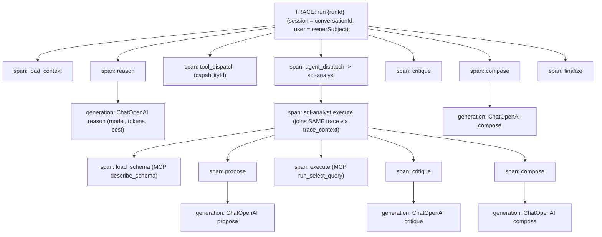

# Langfuse v3 Observability Integration (native, self-hosted, auto-wired)

- **Status:** Draft (proposal)
- **Owner:** Orchestration / Agents platform
- **Scope:** `docker-compose.yml`, `.env` / `.env.example`, `services/orchestrator`, `agents/at-sql-analyser`, agent + orchestrator Dockerfiles and `pyproject.toml`
- **Related rules:** `010-security-by-design`, `000-core-engineering`, `040-python-langgraph-agents`, skill `resources/observability-langfuse.md`

---

## 1. Problem & goal

The platform is documented as "observed with Langfuse" (`AGENTS.md`), and the SQL agent ships a scaffolded but **inert** `LoggingTracer` (`build_tracer()` only logs; no SDK calls). The orchestrator has **zero** tracing. There is **no Langfuse server, no `LANGFUSE_*` env, and no model pricing**.

We want a **single `docker compose up` from the repo root** to:

1. Stand up a **self-hosted Langfuse v3** stack (latest stable, OpenTelemetry-native).
2. **Headlessly seed** an org `nova`, a project `nova-chat`, a user `admin@test.com` / `admin`, and a **pinned public/secret key pair** (controlled values from `.env`) so every agent auto-wires with no manual UI step.
3. **Seed model pricing** for OpenAI (built-in) and **kimi-2.6** (custom, via the Models API).
4. Have **both Python services (orchestrator worker + `at-sql-analyser`) share one Langfuse context per run**, with traces **nested**: one trace per user run, child spans per LangGraph node, the agent's work nested under the orchestrator's `agent_dispatch` span, and a generation span for **every LLM call** plus a span for **every tool/MCP invocation**.
5. Use **only the native `langfuse` package** (`@observe`, `langfuse.langchain.CallbackHandler`, `propagate_attributes`, `create_trace_id`, `trace_context`, native `mask`). No custom tracing protocol.

### Non-goals

- Replacing the existing Postgres outbox events / SSE stream (operator + user visibility stays).
- Production HA Langfuse (Kubernetes). Compose single-instance is the target, matching the rest of the stack.
- Instrumenting the Node/TS API or frontend (future; this plan covers the Python execution plane where LLM/tool calls happen).

---

## 2. Key decisions (latest stable, confirmed)

- **Langfuse v3** (OpenTelemetry-native). Self-host requires 6 components; we provision them **dedicated and isolated** (own Postgres/ClickHouse/Redis/MinIO), keeping Nova's business DB, `postgres-agents`, and the three Redis instances untouched. The `redis-agent` design doc explicitly forbids reusing those stores.
- **Python SDK v3** (`langfuse>=3,<4`). Replaces the `>=2.50,<3` extra currently in [`agents/at-sql-analyser/pyproject.toml`](agents/at-sql-analyser/pyproject.toml).
- **kimi-2.6 reached via OpenAI-compatible endpoint** (`OPENAI_BASE_URL` + model name), so the existing `langchain_openai.ChatOpenAI` client is reused unchanged; only the recorded `model` string differs, which is all Langfuse needs for cost inference.
- **OpenAI pricing is already built into Langfuse** (Langfuse-maintained model list). The seed job therefore only needs to **add kimi-2.6** and may optionally re-assert any gateway-aliased OpenAI names.
- **Fail-soft**: a Langfuse outage must never fail a run (mirrors the Redis fail-soft philosophy). The v3 SDK already exports asynchronously/non-blocking; we additionally gate on `LANGFUSE_TRACING_ENABLED`.

---

## 3. Target trace hierarchy

One trace per **agent run** (`runId`), shared across both services.



- **Each agent's begin/end** is visible as its own enclosing span (`reason`, `agent_dispatch`, `sql-analyst.execute`, ...) with start/end timestamps and status.
- **Each LLM call** is a native `generation` span (model + token usage + inferred cost).
- **Each tool/MCP/capability invocation** is a span with safe metadata (capability id, row count, sql hash — never raw SQL/rows).

---

## 4. Infrastructure: docker-compose additions

Add a Langfuse block to [`docker-compose.yml`](docker-compose.yml). All new named volumes appended to the `volumes:` section.

### 4.1 New services

- **`langfuse-postgres`** — `postgres:17` (Langfuse requires its own DB; `TZ=UTC`, `PGTZ=UTC`). Internal only. Volume `nova-langfuse-postgres-data`.
- **`langfuse-clickhouse`** — `clickhouse/clickhouse-server:25.8`. Internal only. Volumes `nova-langfuse-clickhouse-data`, `nova-langfuse-clickhouse-logs`. Healthcheck via `wget .../ping`.
- **`langfuse-minio`** — `minio` (chainguard image), entrypoint creates the `langfuse` bucket. Internal only (console optional on `127.0.0.1:9091`). Volume `nova-langfuse-minio-data`.
- **`langfuse-redis`** — `redis:7`, `--requirepass`, `--maxmemory-policy noeviction`. Internal only (separate from Nova's three Redis instances). Volume `nova-langfuse-redis-data`.
- **`langfuse-web`** — `langfuse/langfuse:3`. Published on host **`3100:3000`** (host `3000` is taken by `nova-api`). Carries all `LANGFUSE_INIT_*` headless-seed vars. `depends_on` all four stores healthy. Healthcheck on `/api/public/health`.
- **`langfuse-worker`** — `langfuse/langfuse-worker:3`. Internal only (`3030`). Same store dependencies.
- **`langfuse-seed`** — one-shot (`restart: "no"`) that waits for `langfuse-web` healthy and upserts the **kimi-2.6** model price via the public Models API (section 6). Idempotent.

### 4.2 Secrets (generated once, stored in `.env`)

- `LANGFUSE_NEXTAUTH_SECRET` = `openssl rand -base64 32`
- `LANGFUSE_SALT` = `openssl rand -base64 16`
- `LANGFUSE_ENCRYPTION_KEY` = `openssl rand -hex 32` (exactly 64 hex chars)
- `LANGFUSE_POSTGRES_PASSWORD`, `LANGFUSE_CLICKHOUSE_PASSWORD`, `LANGFUSE_REDIS_PASSWORD`, `LANGFUSE_MINIO_ROOT_PASSWORD`
- `langfuse-web`: `NEXTAUTH_URL=http://localhost:3100`, `TELEMETRY_ENABLED=false`, plus `DATABASE_URL`, `CLICKHOUSE_URL/MIGRATION_URL/USER/PASSWORD`, `REDIS_*`, `LANGFUSE_S3_EVENT_UPLOAD_*` pointing at the dedicated stores.

> Security: these stay dev-default in `.env.example` but are flagged "rotate for any non-local environment"; Langfuse web is the only host-published Langfuse port. Internal stores are never published, consistent with the existing compose discipline.

---

## 5. Headless seeding (org / project / user / keys)

Set on **`langfuse-web`** (must be unquoted per Langfuse docker-compose guidance):

| Variable | Value |
|---|---|
| `LANGFUSE_INIT_ORG_ID` | `nova` |
| `LANGFUSE_INIT_ORG_NAME` | `nova` |
| `LANGFUSE_INIT_PROJECT_ID` | `nova-chat` |
| `LANGFUSE_INIT_PROJECT_NAME` | `nova-chat` |
| `LANGFUSE_INIT_PROJECT_PUBLIC_KEY` | `${LANGFUSE_PUBLIC_KEY}` (pinned, e.g. `pk-lf-nova-chat-dev`) |
| `LANGFUSE_INIT_PROJECT_SECRET_KEY` | `${LANGFUSE_SECRET_KEY}` (pinned, e.g. `sk-lf-nova-chat-dev`) |
| `LANGFUSE_INIT_USER_EMAIL` | `admin@test.com` |
| `LANGFUSE_INIT_USER_NAME` | `Admin` |
| `LANGFUSE_INIT_USER_PASSWORD` | `admin` |

- `LANGFUSE_INIT_ORG_ID` is the **gate**: if unset, all other init vars are silently ignored (Langfuse `initialize.ts`). It is set, so seeding runs on first boot and is **idempotent** (upsert; no-op if resources exist).
- The **same** pinned `LANGFUSE_PUBLIC_KEY` / `LANGFUSE_SECRET_KEY` are read by the agent services for auto-wiring (section 7) — this is the "controlled key seeding" that removes the manual copy-from-UI step.
- The headless path hashes the password directly (no UI min-length form validation), so `admin` is accepted. Login at `http://localhost:3100` with `admin@test.com` / `admin`.

---

## 6. Model pricing seeding

- **OpenAI**: Langfuse v3 ships predefined OpenAI model definitions and prices; ingested generations with `model="gpt-4o-mini"` (etc.) get cost inferred automatically. No action needed beyond confirming presence.
- **kimi-2.6**: not in the built-in list → seed a custom model definition via the **native public Models API** (`POST /api/public/models`, Basic auth with the seeded public/secret keys). Done by the **`langfuse-seed`** one-shot service.
  - `modelName: "kimi-2.6"`, `matchPattern: "(?i)^kimi-2\\.6$"`, `unit: "TOKENS"`, prices `{ input: <USD/token>, output: <USD/token> }` (fill with current Moonshot kimi-2.6 rates — left as configurable env so price changes don't need code edits).
  - Idempotent: the seed script first `GET /api/public/models`; if a `kimi-2.6` definition with the same match pattern exists, it exits 0.
- The seed job is a tiny script using the native API (no custom model handling) — recommended `curl`/`python -m` invocation baked into the `langfuse-seed` service command, reading `LANGFUSE_HOST` + keys + `KIMI_INPUT_PRICE` / `KIMI_OUTPUT_PRICE` from env.

> Exact Models API field names should be confirmed against the running version (`GET /api/public/models` reveals the schema), as v3 evolved the price object shape.

---

## 7. Auto-wiring the agents (env contract)

Both Python LLM-bearing services receive the **same** three vars (internal host + pinned keys), so they emit to the same project with no manual step:

| Variable | orchestrator-worker | at-sql-analyser | Value |
|---|---|---|---|
| `LANGFUSE_HOST` | yes | yes | `http://langfuse-web:3000` (internal) |
| `LANGFUSE_PUBLIC_KEY` | yes | yes | `${LANGFUSE_PUBLIC_KEY}` |
| `LANGFUSE_SECRET_KEY` | yes | yes | `${LANGFUSE_SECRET_KEY}` |
| `LANGFUSE_TRACING_ENABLED` | yes | yes | `true` |
| `LANGFUSE_ENVIRONMENT` | yes | yes | `${NODE_ENV:-development}` |

- Added to the `celery-worker` and `at-sql-analyser` `environment:` blocks in [`docker-compose.yml`](docker-compose.yml), plus the root [`.env.example`](.env.example). The gateway and `celery-webhook` roles don't reason, so they don't need keys (but harmless to pass).
- Add `langfuse-web: { condition: service_healthy }` to the `depends_on` of `celery-worker` and `at-sql-analyser` so keys exist before first trace. Because tracing is fail-soft, this is for clean startup ordering, not a hard runtime dependency.

---

## 8. Python SDK integration

### 8.1 Dependencies & Dockerfiles

- [`agents/at-sql-analyser/pyproject.toml`](agents/at-sql-analyser/pyproject.toml): bump optional extra to `observability = ["langfuse>=3,<4"]` (currently `>=2.50,<3`).
- [`services/orchestrator/pyproject.toml`](services/orchestrator/pyproject.toml): add `observability = ["langfuse>=3,<4"]` extra (none today).
- [`agents/at-sql-analyser/Dockerfile`](agents/at-sql-analyser/Dockerfile): install `".[observability]"` (currently installs base only, so Langfuse isn't in the image).
- [`services/orchestrator/Dockerfile`](services/orchestrator/Dockerfile): install `".[observability]"`.

### 8.2 Thin native wiring (one small module per service)

Add `observability/langfuse_tracing.py` to each service. This is **configuration/wiring only** around the native SDK — not a custom tracing abstraction:

- `is_enabled()` reads `LANGFUSE_TRACING_ENABLED` + presence of keys.
- `get_langfuse()` returns the native `get_client()` singleton, configured with a **native `mask` callable** that reuses the existing `scrub()` (agent) / `safe_io()` (orchestrator) redaction so inputs/outputs are sanitized **before** export. This satisfies rules `010`/`040` ("never send secrets/PII/raw prompts to Langfuse") while keeping native auto-capture.
- `make_callback_handler()` returns `langfuse.langchain.CallbackHandler()` **constructed inside the active observation** (so LLM generations nest correctly).

### 8.3 Orchestrator instrumentation (`services/orchestrator`)

Root trace is per run, deterministic and correlatable to `runId`.

- In [`tasks.py`](services/orchestrator/src/nova_orchestrator/tasks.py) `process_run` (entry of the Celery task), open the **root observation** with a deterministic trace id:
  - `trace_id = Langfuse.create_trace_id(seed=run_id)` → stable, correlatable, and the shared id the agent will join.
  - `with langfuse.start_as_current_observation(as_type="span", name="orchestrator.run", trace_context={"trace_id": trace_id, "parent_span_id": <16-hex synthetic>}) as root:` then `propagate_attributes(session_id=conversation_id, user_id=owner_subject, metadata={"runId": run_id})`.
- Wrap each LangGraph node in [`graph.py`](services/orchestrator/src/nova_orchestrator/graph.py) (`load_context`, `reason`, `tool_dispatch`, `agent_dispatch`, `critique`, `compose`, `finalize`) with `@observe(name=...)` (or `start_as_current_observation`) so each node is a child span with begin/end.
- In [`llm.py`](services/orchestrator/src/nova_orchestrator/llm.py) `OpenAIReasoner.reason/critique/compose`, pass `config={"callbacks": [make_callback_handler()]}` into the existing `ChatOpenAI` `invoke`/`bind_tools(...).invoke`/`with_structured_output(...).invoke` calls → native `generation` spans with model + token usage + cost (works for `gpt-4o-mini` and `kimi-2.6` alike).
- `tool_dispatch` and `agent_dispatch` spans carry safe metadata (`capabilityId`, `skillId`, target agent) — never raw goal/SQL.
- `root.update_trace(input=..., output=...)` set from the composed answer **through `mask`**.

### 8.4 Cross-service nesting over A2A (native, header-free)

The A2A hop uses the SDK's own `httpx` client; rather than instrument transport, we propagate context **deterministically** through the existing extensible A2A `DataPart` (which already carries `runId`, `conversationId`, `correlationId`):

- In [`agent_client.py`](services/orchestrator/src/nova_orchestrator/agent_client.py) `send_task`, add two fields to the payload dict:
  - `langfuseTraceId` = the run's deterministic trace id.
  - `langfuseParentObservationId` = `langfuse.get_current_observation_id()` captured inside the `agent_dispatch` span.
- These are **non-sensitive** trace identifiers (W3C-style), so they are safe to send (unlike baggage of user/session attributes).

### 8.5 Agent instrumentation (`agents/at-sql-analyser`)

- In [`server.py`](agents/at-sql-analyser/src/at_sql_analyser/server.py) `SqlAnalystExecutor.execute`, read `langfuseTraceId` + `langfuseParentObservationId` from the A2A task, then open the agent's root span **joined to the orchestrator trace**:
  - `with langfuse.start_as_current_observation(as_type="span", name="sql-analyst.execute", trace_context={"trace_id": langfuseTraceId, "parent_span_id": langfuseParentObservationId}):`
  - Falls back to `create_trace_id(seed=run_id)` if the fields are absent (e.g. agent invoked directly), so the agent still produces a coherent trace.
- Wrap the LangGraph nodes in [`harness/graph.py`](agents/at-sql-analyser/src/at_sql_analyser/harness/graph.py) (`load_schema`, `propose`, `validate`, `execute`, `critique`, `compose`, `plan_writes`, `dispatch_writes`, `compose_writes`) with `@observe`/`start_as_current_observation`.
- In [`harness/llm.py`](agents/at-sql-analyser/src/at_sql_analyser/harness/llm.py) pass `config={"callbacks": [make_callback_handler()]}` into each `ainvoke` (`propose_query`, `critique`, `compose`, `plan_writes`, `compose_writes`) → generation spans.
- MCP reads in [`mcp/data_client.py`](agents/at-sql-analyser/src/at_sql_analyser/mcp/data_client.py) (`describe_schema`, `run_select_query`) and capability writes in [`tools/capability_client.py`](agents/at-sql-analyser/src/at_sql_analyser/tools/capability_client.py) wrapped as spans with safe metadata (row count, sql hash, `capabilityId`).
- **Replace the inert tracer**: [`observability/tracing.py`](agents/at-sql-analyser/src/at_sql_analyser/observability/tracing.py) `build_tracer()` keeps the `Tracer` protocol + `scrub()` (still used for the orchestrator SSE event payloads), but the Langfuse emission now flows through the native SDK spans above rather than `LoggingTracer`. The existing scrubbed-events-to-orchestrator path is untouched.

### 8.6 Sequence (per run)

```mermaid
sequenceDiagram
  participant W as celery-worker (orchestrator)
  participant LF as Langfuse
  participant A as at-sql-analyser
  W->>LF: start trace run {runId} (id = create_trace_id(seed=runId))
  W->>LF: span reason -> generation ChatOpenAI
  W->>A: A2A send_task (+langfuseTraceId, +parentObservationId)
  A->>LF: span sql-analyst.execute (trace_context = same traceId, parent = parentObservationId)
  A->>LF: spans load_schema / propose(gen) / execute / critique(gen) / compose(gen)
  A-->>W: A2A result (typed)
  W->>LF: span critique(gen) -> compose(gen) -> finalize
  W->>LF: update_trace(output) ; flush()
```

Both services flush on shutdown (`langfuse.flush()`); the worker flushes at the end of `process_run` so short-lived task processes don't drop spans.

---

## 9. Security & redaction (rules 010 / 040)

- **Native `mask`** on the client redacts all auto-captured inputs/outputs (prompts, completions, structured args) before export — reuses existing `scrub()` / `safe_io()` and the `_FORBIDDEN_KEYS` set (sql, rows, email, token, secret, goal, answer, ...).
- Trace **metadata** is limited to correlation/operational ids: `runId`, `conversationId` (session), owner subject (user), `capabilityId`, `skillId`, environment, model — matching `observability-langfuse.md`.
- Cross-service propagation sends **only trace ids** (non-sensitive), never `as_baggage` user/session attributes over HTTP.
- Internal Langfuse stores never published; web UI is the only host-published port. Fail-soft: tracing errors are caught and logged, never raised into the run.
- Self-review against `resources/code-review-checklist.md` ("Are Langfuse traces redacted and useful?").

---

## 10. Config / env additions (`.env` + `.env.example`)

```
# --- Langfuse (self-hosted v3) ---
LANGFUSE_HOST=http://langfuse-web:3000
LANGFUSE_PUBLIC_KEY=pk-lf-nova-chat-dev
LANGFUSE_SECRET_KEY=sk-lf-nova-chat-dev
LANGFUSE_TRACING_ENABLED=true
LANGFUSE_ENVIRONMENT=development
# Langfuse server secrets (rotate outside local)
LANGFUSE_NEXTAUTH_SECRET=change-me-base64-32
LANGFUSE_SALT=change-me-base64-16
LANGFUSE_ENCRYPTION_KEY=change-me-hex-64
LANGFUSE_POSTGRES_PASSWORD=langfuse_pg_password
LANGFUSE_CLICKHOUSE_PASSWORD=langfuse_ch_password
LANGFUSE_REDIS_PASSWORD=langfuse_redis_password
LANGFUSE_MINIO_ROOT_PASSWORD=langfuse_minio_password
# kimi-2.6 custom pricing (USD per token)
KIMI_INPUT_PRICE=0.8
KIMI_OUTPUT_PRICE=3.4
```

---

## 11. Testing

- **Unit:** `mask` redacts forbidden keys; `is_enabled()` gating; deterministic `create_trace_id(seed=run_id)` stability; agent joins parent trace when `langfuseTraceId` present and falls back when absent (use the native SDK in a no-export/test mode).
- **Integration (compose):** `docker compose up` → `langfuse-web` healthy → seed creates org/project/user/keys (login works at `:3100`) → `langfuse-seed` upserts kimi-2.6 → run a chat turn → one trace per run with nested orchestrator + agent spans, generation spans showing token cost for `gpt-4o-mini` and `kimi-2.6`.
- **Security:** assert no raw SQL/rows/PII/prompts/secrets appear in any exported span (mask test).
- **Resilience:** stop `langfuse-web` mid-run → run still completes (fail-soft).
- Run repo format/lint/typecheck/test for both Python services; do not weaken settings. Validate the skill library (`AGENTS.md`).

---

## 12. Rollout phases

1. **Infra:** add Langfuse stack + headless seed + `langfuse-seed` to compose; `.env` vars. Verify UI/login/keys.
2. **Wiring module:** add native `observability/langfuse_tracing.py` (+ `mask`) to both services; deps + Dockerfile installs. No behaviour change yet (flag off).
3. **Orchestrator:** root trace + node spans + `CallbackHandler` in `llm.py`. Single-service traces appear.
4. **Cross-service:** propagate trace id + parent observation id over A2A; agent joins. Nested traces appear.
5. **Agent:** node spans + `CallbackHandler` + MCP/capability spans; retire `LoggingTracer` emission.
6. **Pricing + hardening:** confirm OpenAI built-in prices, kimi-2.6 seed, redaction review, fail-soft tests, docs.

Each phase is independently shippable; everything is reversible via `LANGFUSE_TRACING_ENABLED=false`.

---

## 13. Risks & assumptions

| Item | Note / mitigation |
|---|---|
| Port collision | Langfuse web host port remapped to `3100` (API owns `3000`). |
| Resource footprint | +6 containers (ClickHouse heaviest; ~1 min first-boot migration). Dev-acceptable; documented. |
| Native auto-capture vs redaction | Resolved via native `mask`; no custom span schema. |
| `admin` password length | Accepted via headless init path (no UI form validation). Verify on first boot. |
| Models API price schema | Confirm v3 field shape via `GET /api/public/models` before finalizing seed payload. |
| kimi-2.6 prices | Left as `KIMI_*` env placeholders; fill with current Moonshot rates. |
| A2A short-circuit (tool path) | When orchestrator uses the Node tool gateway instead of an agent, only orchestrator spans exist (correct — no agent ran). |

### Open questions

1. Should `celery-webhook` / `orchestrator` gateway also carry keys (harmless, but they never reason)? Default: no.
2. Do we want a project-level data-retention (`LANGFUSE_INIT_PROJECT_RETENTION`) for local? Default: unset (retain forever).
3. Should the orchestrator's deterministic trace id also be persisted on the `AgentRun` row (Postgres) for click-through from the audit ledger to Langfuse? (Recommended follow-up.)
